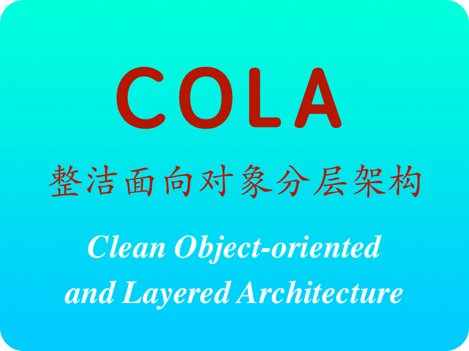
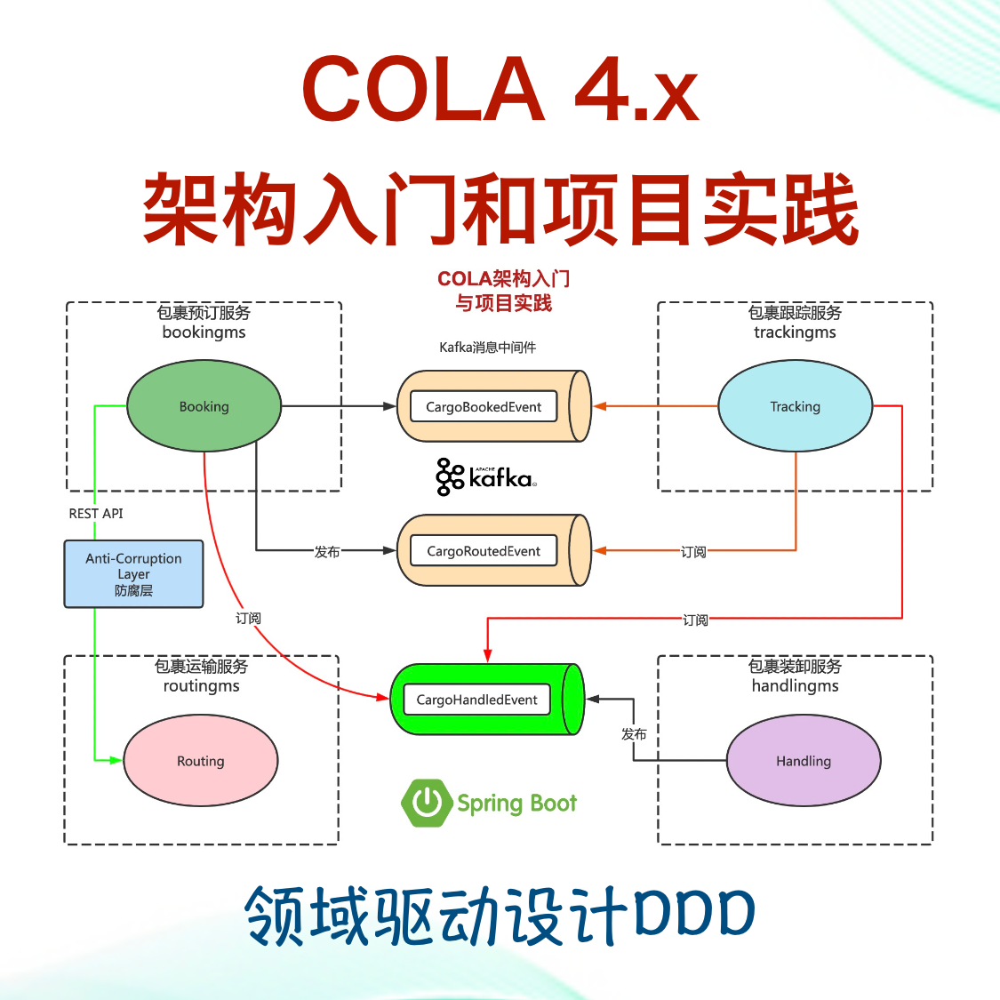
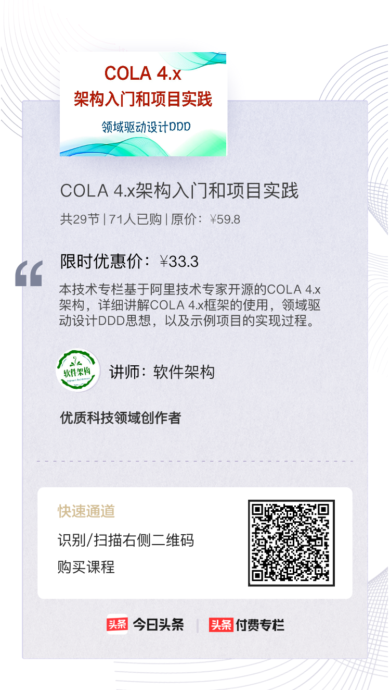

# 专栏简介
本技术专栏基于阿里技术专家开源的COLA 4.x架构，详细讲解COLA 4.x框架的使用，领域驱动设计DDD思想，以及示例项目的实现过程。 

# 专栏介绍
COLA 是 Clean Object-Oriented and Layered Architecture的缩写，代表“整洁面向对象分层架构”，是来自阿里技术专家的开源项目。目前COLA已经发展到COLA 4.0。
COLA既是框架，也是架构。开源作者创建COLA的主要目的是为DDD应用架构提供一套简单的可以复制、可以理解、可以落地、可以控制复杂性的“指导和约束”。
COLA 开源地址：https://github.com/alibaba/COLA。

本技术专栏重点介绍了其中的COLA架构，并且通过经典的示例项目开发，理论联系实际，帮助初学者快速掌握COLA架构的使用以及DDD领域驱动设计应用项目的开发过程。

# 专栏大纲
本技术专栏基于阿里技术专家开源的COLA 4.x架构，详细讲解COLA框架的使用，领域驱动设计DDD的建模过程，以及DDD经典示例项目-货物运输系统（Cargo Tracker Application）代码实现细节。

2004 年，DDD（领域驱动设计）这一软件开发的方法与愿景经由建模专家 Eric Evans 的经典著作Domain-Driven Design: Tackling Complexity in the Heart of Software 正式面世，当即获得了广泛关注和高度评价。17 年间，网上越来越多关于 DDD的文章和讨论。为什么我们现在还不停地讨论 DDD？为什么DDD仍然如此重要？
在商业组织中，主张“技术为业务服务”的企业总可以在理论上立于不败之地。诚然，DDD主张在软件项目中把领域本身作为关注的焦点（换句话说就是技术人员要懂业务）符合这种思想，但真正难能可贵的是，DDD提供了切实可行的应对软件核心复杂性的方法。

DDD 是一个指导思想，本身没有一个标准的代码模型。
但是一个好的应用架构，必须遵循一些共同代码模型。

下面是DDD应用项目中常用的一些应用架构或代码模型：
* 分层架构 （Layered Architecture）
* 六边形架构（Hexagonal Architecture）
* 洋葱架构（ Onion Architecture）
* CQRS（Command Query Responsibility Segregation，命令查询职责分离）
* COLA架构 （Clean Object-Oriented and Layered Architecture，整洁面向对象分层架构）
* Axon框架（DDD+CQRS+Event Sourcing），另外一个技术专栏《Axon框架快速入门和DDD项目实践》有详细的介绍

主要内容如下：
* 开源COLA 4.0架构和DDD领域驱动设计入门介绍
* 体验COLA示例应用项目craftsman：环境准备、启动运行和代码分析(1)
* 体验COLA示例应用项目craftsman：环境准备、启动运行和代码分析(2)
* 如何使用COLA框架创建业务应用项目？
* COLA框架源码编译发布到本地Maven仓库的完整过程
* COLA项目模板和IDEA开发工具的集成
* 基于COLA架构创建DDD经典示例项目Cargo货物运输系统和领域建模
* COLA架构和DDD经典示例项目：领域模型中命令和命令处理程序的实现
* COLA架构和DDD经典示例项目：Gateway接口和实现
* COLA架构和DDD经典示例项目：创建MySQL包裹预订数据库表和访问账号
* COLA架构和DDD经典示例项目：自动生成数据访问层代码
* COLA架构和DDD经典示例项目：GatewayImpl实现类的开发
* COLA架构和DDD经典示例项目：数据流转图和转换工具类开发
* COLA架构和DDD经典示例项目：服务接口和应用服务实现类的开发
* COLA架构和DDD经典示例项目：启动应用并发起包裹预订请求
* COLA架构和DDD经典示例项目：包裹查询服务的实现
* 基于COLA架构创建运输微服务应用和DDD领域建模
* 基于COLA架构开发和实现运输微服务应用
* 防腐层设计与实践：隔离限界上下文之间的耦合，实现干净的领域模型
* 防腐层设计与实践：在包裹预订服务中通过防腐层实现包裹路由服务
* 领域事件入门实践：包裹预订事件和包裹路由事件建模
* 领域事件入门实践：基于Kafka消息中间件发布领域事件
* 基于COLA架构创建包裹跟踪微服务应用和DDD领域建模
* 领域事件入门实践：基于Kafka消息中间件监听包裹预订事件和包裹路由事件
* 领域事件入门实践：监听包裹路由事件的完整实现
* 包裹预订、运输、跟踪服务之间的联调测试
* 基于COLA架构创建包裹装卸微服务应用和DDD领域建模
* …...

# 适合人群
本专栏主要面向有一定Java项目开发实践经验的软件开发人员、架构师、技术专家等等，或者希望学习COLA 4.x架构和领域驱动设计DDD思想的相关人员。

# 学习收获
通过学习COLA 4.x架构和DDD领域驱动设计思想，并结合实际的货物运输系统（Cargo Tracker Application）应用项目开发过程，对COLA 4.x架构和DDD建模过程以及代码落地获得更加深入的理解。

